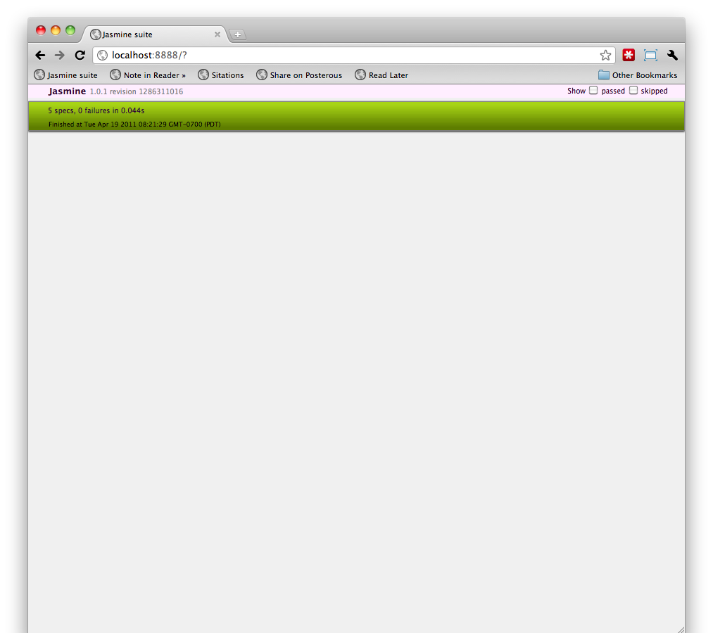

# PracticalJasmine @ PhillyETE 2011

!SLIDE middle small

# Practical Jasmine


## Well-behaved JavaScript BDD

### [Davis W. Frank](mailto:dwfrank@pivotallabs.com) | [Pivotal Labs](http://pivotallabs.com) | [Bio](http://dwf.bigpencil.net)

!SLIDE

}}} images/Jasmine-aladdin-4918036-1920-1200.jpg

!SLIDE

}}} images/s4_jasmine1.jpg

!SLIDE tea

}}} images/tea.jpg::bmmaran::flickr::http:://flickr.com/bmmaran

!SLIDE middle

# BDD for JavaScript

## (read: yet another JS unit testing framework)

!SLIDE middle

# 'RSpec for JavaScript'

## _Making JavaScript BDD safe for_
## _Rubyists since 2009_

!SLIDE middle

# No DOM

!SLIDE middle

# No Frameworks

!SLIDE middle

# No Request/Response

!SLIDE middle

# Where?

!SLIDE middle


!SLIDE middle


!SLIDE middle


!SLIDE middle

# How?

!SLIDE middle

# (Follow along at home)

## [https://gist.github.com/944616](https://gist.github.com/944616)

!SLIDE middle


!SLIDE

``` javascript 
// BallSpec.js
it("should start deflated", function() {
  expect(ball.isFull()).toEqual(false);
});
```

!SLIDE

``` javascript
// BallSpec.js
describe("Ball", function () {
  var ball;
  
  beforeEach(function() {
    ball = new Ball();
  });
  
  it("should start deflated", function() {
    expect(ball.isFull()).toEqual(false);
  });
});
```

!SLIDE

``` javascript
// BallSpec.js
describe("Ball", function () {
  ...
  describe("#inflate", function () {
    beforeEach(function() {
      ball.inflate();
    });
    ...
  });
});
```

!SLIDE

# Disable a spec

``` javascript 
xit("should start deflated", function() {
  expect(ball.isFull()).toEqual(false);
});
```

!SLIDE

# Disable a collection of specs

``` javascript
xdescribe("#inflate", function () {
  ...
});
```

!SLIDE middle

# Spies

## mocks, stubs, fakes, doubles

!SLIDE

``` javascript 
// GameSpec.js
describe("Game", function () {
  var game, ball;

  beforeEach(function() {
    ball = new Ball();
    spyOn(ball, 'inflate').andCallThrough();
	game = new Game();
  });
  ...
});
```

!SLIDE

``` javascript 
// GameSpec.js
describe("Game", function () {
  ...
  describe("with a not-full ball", function() {
	beforeEach(function() {
      game.prepare(ball);
	});

	it("should inflate before play", function() {
	  expect(ball.inflate).toHaveBeenCalled();
	});
  });
});
```

!SLIDE


!SLIDE

```javascript
// Game.js
function Game() {
  this.prepare = function(ball) {
    if (ball.isFull()) {
      return;
    }
    ball.inflate();
  };
}

// Ball.js
function Ball() {
  var full = false;

  this.inflate = function() {
    full = true;
  };

  this.isFull = function() {
    return full;
  };
}
```
!SLIDE



!SLIDE middle

# Let's Get Practical

!SLIDE middle question

## "How do I manage a big project?"

!SLIDE middle

# Jasmine Gem

## Better than a barrel of `<script>`
	
### It's not just for Ruby projects

!SLIDE middle question

## "How do I perform test 

## setup & teardown?"

!SLIDE

```javascript
beforeEach(function() {
	// everything in here will run before each spec
});
```

!SLIDE middle question

## "How do I test timer-based code?"

!SLIDE middle

# Use the Mock Clock

`jasmine.Clock.useMock()`

!SLIDE

```javascript
describe("A setTimeout's callback", function () {
  beforeEach(function() {
    jasmine.Clock.useMock();    
  });

  it("should only be called at the right time", function() {
    var expected = false;
    setTimeout(function() {
      expected = true;
    }, 100);
    expect(expected).toBe(false);
    jasmine.Clock.tick(101);
    expect(expected).toBe(true);
  });
});
```

!SLIDE middle question

## "How do I test AJAX calls?"

!SLIDE middle

# Setup

## Stub XHR

!SLIDE

```javascript
beforeEach(function() {
  spyOn(jQuery.ajaxSettings, 'xhr').andCallFake(function() {
    var newXhr = new FakeXMLHttpRequest();
    ajaxRequests.push(newXhr);
    return newXhr;
  });

  clearAjaxRequests();
});
```
#### From [Jasmine-Ajax](http://github.com/pivotal/jasmine-ajax)

!SLIDE middle

# Write your Specs

!SLIDE 
```javascript
describe("TwitterApi#search", function(){
  var twitter, request, callbacks

  beforeEach(function(){
    twitter = new TwitterApi();
    callbacks = new AjaxCallbacks();

    twitter.search('basketball', callbacks);

    request = mostRecentAjaxRequest();
  });

  it("calls Twitter with the correct url", function(){
    expect(request.url).toEqual("http://search.twitter.com/search.json?q=basketball")
  });
});
```
#### From [Jasmine-Ajax](http://github.com/pivotal/jasmine-ajax)

!SLIDE middle

# Use Response Fixtures

!SLIDE
  
```javascript
describe("on success", function(){

  beforeEach(function(){
    request.response(TestResponses.search.success);
  });

  it("calls onSuccess with an array of Tweets", function(){
    var successArgs = callbacks.onSuccess.mostRecentCall.args[0];

    expect(callbacks.onSuccess).toHaveBeenCalledWith(jasmine.any(Array));
    expect(successArgs.length).toEqual(15);
    expect(successArgs[0]).toEqual(jasmine.any(Tweet));
  });
});
```
#### From [Jasmine-Ajax](http://github.com/pivotal/jasmine-ajax)

!SLIDE middle question

## "How do I write 
## asynchronous specs?"

!SLIDE middle

# Are you writing an Async API?

## Use `waitsFor()` & `runs()`

!SLIDE

```javascript
describe('when there are more elements below the currently-selected element', function() {
  var blurEvent, focusEvent;
  beforeEach(function() {
    $('body')
      .bind('blur.justKidding',  function(e) { blurEvent  = e; })
      .bind('focus.justKidding', function(e) { focusEvent = e; })
  });

  it('should select the next element', function() {
    runs(function() {
      $('body').simulate('keypress', { charCode: 'j'.charCodeAt(0) });
    });

    waitsFor(function() {
      return blurEvent || focusEvent;
    }, "events to fire", 1000);

    runs(function() {
      expect($('.current').html()).toEqual('Jakob became a crab farmer');
    });
  });
});
```
### [https://gist.github.com/803024](https://gist.github.com/803024)

!SLIDE middle question

## "How do I share code across tests?"

!SLIDE middle

# It's JavaScript

## Use a `function`

!SLIDE

```javascript
// SharedBehaviorForGames.js
function sharedBehaviorForGames(context) {
  describe("(shared)", function() {
    var ball, game;
    beforeEach(function() {
	  ball = context.ball;	
      game = context.game;	
    });
	
    describe("with a full ball", function() {
      beforeEach(function() {
	    ball.inflate();
        ball.inflate.reset();      
        game.prepare(ball);
      });

	  it("should not inflate before play", function() {
        expect(ball.inflate).not.toHaveBeenCalled();
      });
    });

    describe("with a not-full ball", function() {
      beforeEach(function() {
        game.prepare(ball);
      });

	  it("should inflate before play", function() {
		expect(ball.inflate).toHaveBeenCalled();
      });
    });
  });
}
```

!SLIDE

```javascript
// FootballGameSpec.js
describe("Football Game", function() {
  var football;

  beforeEach(function(){ 
	football = {
	  ball: new Football,
	  game: new FootballGame	
	};
  });

  it("should score a field goal properly", function() {
    expect(football.game.fieldGoal.points).toEqual(3);	
  });

  sharedBehaviorForGame(football);
});
```

!SLIDE

```javascript
// BasketballGameSpec.js
describe("Basketball Game", function() {
  var basketball;

  beforeEach(function(){ 
	basketball = {
	  ball: new Basketball,
	  game: new BasketballGame	
	};
  });

  it("should score a field goal properly", function() {
    expect(basketball.game.fieldGoal.points).toEqual(2);	
  });

  sharedExamplesForGame(basketball);
});
```

!SLIDE middle

# Mobile?

!SLIDE middle

# Mobile _web_

!SLIDE middle

# ...or JS in Native Containers

!SLIDE middle

# Develop in the Browser

## until you can't

!SLIDE middle

# Test _your_ Code
<br/><br/>
# not the Framework

## Read [The Humble Dialog Box](http://www.objectmentor.com/resources/articles/TheHumbleDialogBox.pdf)

!SLIDE middle

# Questions?

!SLIDE middle

# Thanks

## `expect(jasmine).toBeDefined();`


